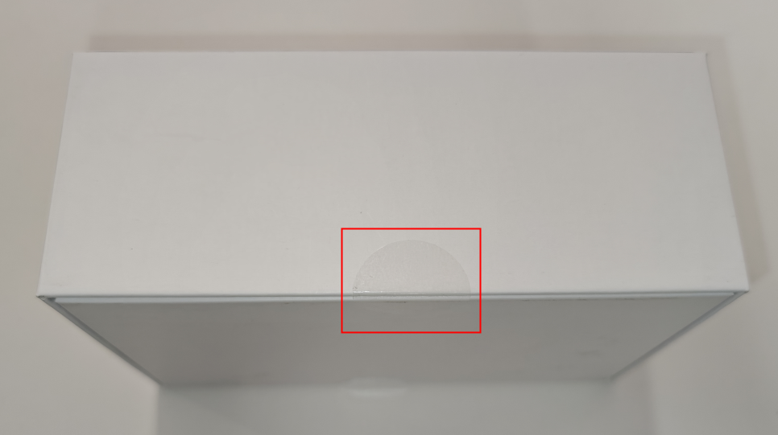
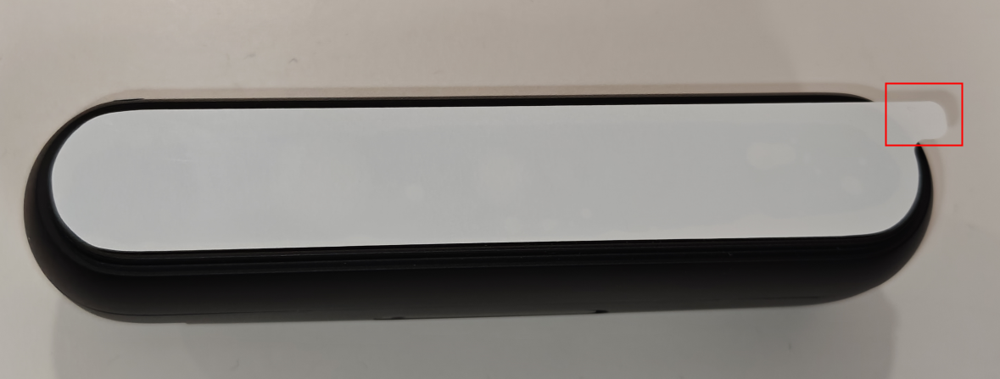
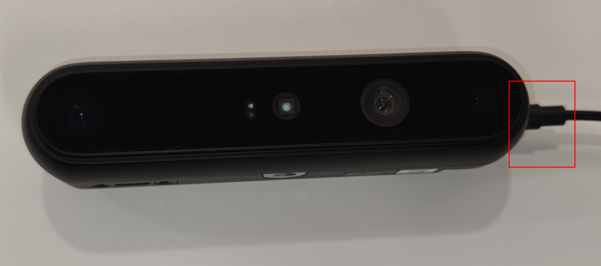
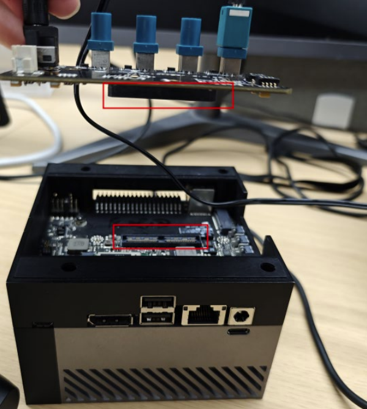
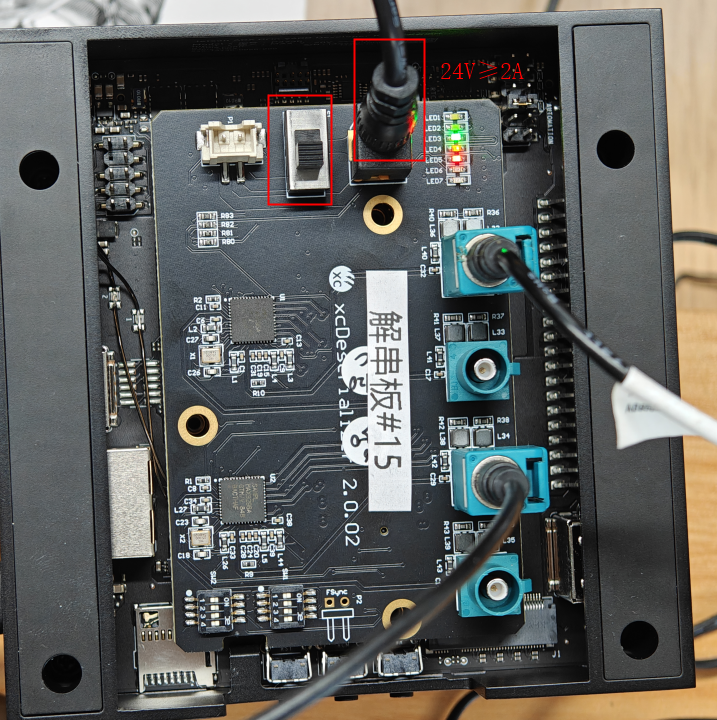
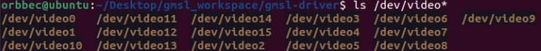
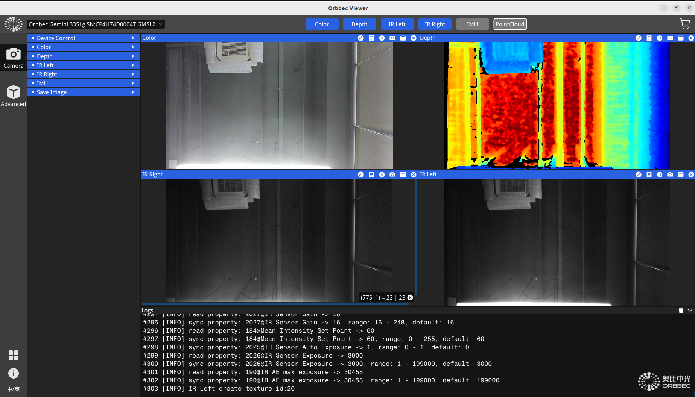

Gemini 335Lg Quick Start
===
## 1.	Unbox
### a)	Remove the circular tape between the upper and lower caps

### b)	Remove the white protective film on the front glass

### c)	Connect the camera & the deserialization board via FAKRA-Z cable

### d)	Connect the deserialization board & the AGX Orin Developer Kit;
***Tips: The AGX Orin JetPack version should be 6.0(r36_release_v3.0);***

### e)	Power on the Developer Kit & deserialization board;
***Deserialization board needs 24V@2A power supply at least;***

## 2.	Load Complied Driver
### a)	Switch to the drive file path
**i.	Bash:  cd ./driver path**
```
cd gmsl-driver/
```
### b)  Execute the “copy_to_target.sh” script
*copy modules to right path*
```
sudo ./copy_to_target.sh
sudo reboot  #reboot system to reconfigure
```
## 3.	Get Started
### a)	Check the driver version
*i.	cat /sys/module/g2xx/version #Orbbec GMSL driver name is “g2xx”. The latest version number for g2xx is 1.0.12*
```
cat /sys/module/g2xx/version
```
### b)	Check the video node total number
*One Gemini 335Lg will have 8 video nodes;*
```
ls /dev/video*
```

### c)  Switch to the Orbbecviewer file path & execute the Orbbecviewer;
```
cd /viewer path  
sudo ./Orbbecviewer 
```
